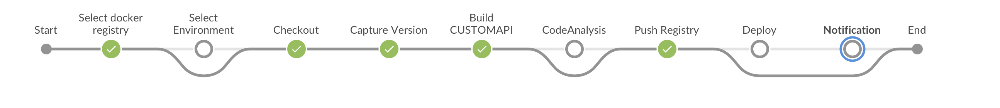

## Customized Jenkins docker image 
Refer below link to set up your jenkins. 
https://pscode.lioncloud.net/engineering-community/monitor-measure-metrics/speedy-product/build-speedy

Once you start speedy-jenkins docker image , you will have jenkins with pre-configured jobs and pre-installed 
required plugins.

### Pre-requisite
* You should have basic idea of declarative pipeline - Jenkinsfile (stages,steps,nodes,pipeline,agent)

### Let's understand pipeline - [customapi-pipeline](customapi/Jenkinsfile)
```
pipeline {
   agent any
   parameters {
           ....
   }
   stages {
      stage('Select docker registry') {
         when{
              expression { env.DEPLOY == 'true' || env.PUSH_REGISTRY == 'true' }
         }
         steps {
            ....
         }
      }
      stage('Select Environment') {
         when {
             expression { env.DEPLOY == 'true' }
         }
         steps {
              ....
         }
      }
      stage('Checkout') {
        when {
                expression { env.CHECKOUT == 'true' }
        }
        steps {
              ....
        }
      }
      stage('Capture Version') {
          steps {
                ....
           }
      }
      stage('Build CUSTOMAPI') {
        when{
            expression { env.BUILD == 'true' }
        }
            steps {
                 ....
            }
      }
	  stage('CodeAnalysis'){
	    when{
            expression { env.SONAR == 'true' }
        }
          steps{
			  sh """
			      ....
			   """
              }
			}
      stage('Push Registry') {
        when{
            expression { env.PUSH_REGISTRY == 'true' }
         }
         steps {
               ....
          }
      }
      stage('Deploy') {
        when{
            expression { env.DEPLOY == 'true' }
        }
          steps {
                ....
            }
      }
      stage('Notification'){
        when{
            expression { env.NOTIFICATION == 'true' }
        }
          steps {
               ....
          }
      }
   }
}
```



### Parameters  
```
   parameters {
           gitParameter defaultValue: 'origin/master', name: 'SBRANCH', type: 'PT_BRANCH_TAG',quickFilterEnabled:true ,description: 'Select Branch'
           booleanParam(name: 'CHECKOUT', defaultValue: 'false', description: 'CHECKOUT')
           booleanParam(name: 'BUILD', defaultValue: 'false', description: 'BUILD')
           booleanParam(name: 'SONAR', defaultValue: 'false', description: 'SONAR')
           booleanParam(name: 'PUSH_REGISTRY', defaultValue: 'false', description: 'PUSH_REGISTRY')
           booleanParam(name: 'DEPLOY', defaultValue: 'false', description: 'DEPLOY')
           string(name: 'REGISTRY_REPOSITORY', defaultValue: 'speedy', description: 'REGISTRY_REPOSITORY')
           string(name: 'verticalIds', defaultValue: 'fs', description: 'verticalIds')
   }
```

* When you set up Jenkins, you will get the list of jobs. We prefer user to use the latest customapi/Jenkinsfile. Each jenkins file contain basic list of projects which 
we require in that particular pipeline. 
* When user will run this job first time it will create list of projects.


### Stage - Select docker registry
```
 stage('Select docker registry') {
         when{
              expression { env.DEPLOY == 'true' || env.PUSH_REGISTRY == 'true' }
         }
         steps {
              script {
                def REGISTRY_LIST = []
                def buildStages = env.getEnvironment()
                for (builds in buildStages) {
                    if(builds.key.startsWith("REGISTRY_")) {
                      REGISTRY_LIST.add(builds.value)
                    }
                }
                env.select_docker_registry = input  message: 'Select docker registry ',ok : 'Proceed',id :'tag_id',
                parameters:[choice(choices: REGISTRY_LIST, description: 'Select docker registry', name: 'dockerregistry')]
                echo "Selected Registry is ${env.select_docker_registry}"
                env.registryCredId="REGISTRY_"+env.select_docker_registry
              }
         }
      }
```

* In above stage - we are collecting the list of configured docker registry in Jenkins environment.
* Benifit of this approach is that we are not hardcoding anything in our codebase, this pipeline code behave like plug and play . User could change the concept.
* To configure docker registry. Goto Manage Jenkins -> Configure System -> Global Properties -> Environment variables
* Add REGISTRY_<integer_number> in "Name" and ip address with port value in "Value"
* For ex:
    ** Name : REGISTRY_1 & Value : setup-speedy.tools.publicis.sapient.com
    ** Name : REGISTRY_2 & Value : 10.140.248.10:5000
* when this stage will get execute -> it will prompt user to select the registry where user want to push docker images.
* User should also create credentialIds for respective docker registries. Goto Credentials -> System -> Global Credentials -> Add Credentials. 
* While configuring credential keep ID = SSH_<Registry_value>. Ex: In case user select setup-speedy.tools.publicis.sapient.com as docker registry 
then credentials ID should be SSH_setup-speedy.tools.publicis.sapient.com


### Stage - Select Environment
```
stage('Select Environment') {
         when {
             expression { env.DEPLOY == 'true' }
         }
         steps {
              script {
                def SERVER_LIST=[]
                def buildStages = env.getEnvironment()
                for (builds in buildStages) {
                    if(builds.key.startsWith("SERVER_")) {
                      SERVER_LIST.add(builds.value)
                    }
                }
                env.selected_environment = input  message: 'Select environment ',ok : 'Proceed',id :'tag_id',
                parameters:[choice(choices: SERVER_LIST, description: 'Select environment', name: 'env')]
                echo "Deploying ${env.selected_environment}."
                env.credId= "SSH_"+env.selected_environment
              }
         }
      }
```

* This stage will prompt user to select the enviroment/machine where user want to deploy all docker images.
* Pre-requisite the selected environemnt should have docker + docker-compose.
* User need to configure servers in environment variables like we did for REGISTRY in upper stage.
* Goto Manage Jenkins -> Configure System -> Global Properties -> Environment variables
* Add SERVER_<integer_number> in "Name" and ip address in "Value"
* For ex:
      ** Name : SERVER_1 & Value : 10.140.240.17
      ** Name : SERVER_2 & Value : 10.140.248.10
* when this stage will get execute -> it will prompt user to select the environment where user want to deploy docker images.
* User should also create credentialIds for respective environment. Goto Credentials -> System -> Global Credentials -> Add Credentials. 
* While configuring credential keep ID = SSH_<environment_value>. Ex: In case user select 10.140.240.17 as environment then credentials ID 
should be SSH_10.140.240.17

### Stage - Checkout 
```
stage('Checkout') {
        when {
                expression { env.CHECKOUT == 'true' }
        }
        steps {
               checkout scm: [$class: 'GitSCM', userRemoteConfigs: [[url: 'https://pscode.lioncloud.net/engineering-community/monitor-measure-metrics/speedy-product/open-source-speedy.git',credentialsId: 'service']], branches: [[name: '${SBRANCH}']]], poll: false
        }
      }
```         
* This stage will checkout the user selected branch using this parameter "SBRANCH"
* Make sure have configured credentials with id "service" for git repository.

### Build CUSTOMAPI
```
stage('Build CUSTOMAPI') {
        when{
            expression { env.BUILD == 'true' }
        }
            steps {
                sh "mvn clean install -Pcustomapi"
            }
      }
```
* This stage will build customapi and create customapi docker image with version.

### Push Registry
```
 stage('Push Registry') {
        when{
            expression { env.PUSH_REGISTRY == 'true' }
         }
         steps {
              withCredentials([usernamePassword(credentialsId: env.registryCredId, passwordVariable: 'REGISTRY_PASSWORD', usernameVariable: 'REGISTRY_USERNAME')]) {
              sh """
                    docker login -u ${REGISTRY_USERNAME} -p ${REGISTRY_PASSWORD} ${env.select_docker_registry}
                    docker tag customapi:${env.version} ${env.select_docker_registry}/speedy/customapi:${env.version}
                    docker push ${env.select_docker_registry}/speedy/customapi:${env.version}
                    docker logout ${env.select_docker_registry}
                """
              }
          }
      }

```
* This stage will login to selected docker registry and then push docker image to docker registry.

### Deploy 
```
      stage('Deploy') {
        when{
            expression { env.DEPLOY == 'true' }
        }
          steps {
                withCredentials([
                usernamePassword(credentialsId: env.credId, passwordVariable: 'SSH_PASSWORD', usernameVariable: 'SSH_USERNAME'),
                usernamePassword(credentialsId: env.registryCredId, passwordVariable: 'REGISTRY_PASSWORD', usernameVariable: 'REGISTRY_USERNAME')
                ]) {
                        sh """
                            > /tmp/customapi_hosts
                            echo "[server]" > /tmp/customapi_hosts
                            echo " ${env.selected_environment}" >> /tmp/customapi_hosts
                            cd ansible_deployment/
                            ansible-playbook -i /tmp/customapi_hosts playbooks/deploy.yaml -e 'registry_username=${REGISTRY_USERNAME}' -e 'registry_password=${REGISTRY_PASSWORD}' -e 'selected_server=${env.selected_environment}' -e 'repository_name=${env.REGISTRY_REPOSITORY}' -e 'selected_registry=${env.select_docker_registry}' -e 'version=${env.version}' -e 'ansible_ssh_pass=${SSH_PASSWORD}' -e 'ansible_ssh_user=${SSH_USERNAME}' -e 'PRECALCULATED_DATA_SHOW=false'  -e 'verticalIds=${env.verticalIds}'
                        """
                }
            }
      }
```
* This stage will execute if user select Deploy option.
* This stage will execute ansible playbook and pass all required parameter into ansible playbook.
* Ansible playbook will execute following tasks 
    ** Connect to server via ssh
    ** Create directory
    ** Create sub directories
    ** Create docker-compose.yaml file
    ** Login to docker registry
    ** Pull docker images
    ** Start docker containers.
    
